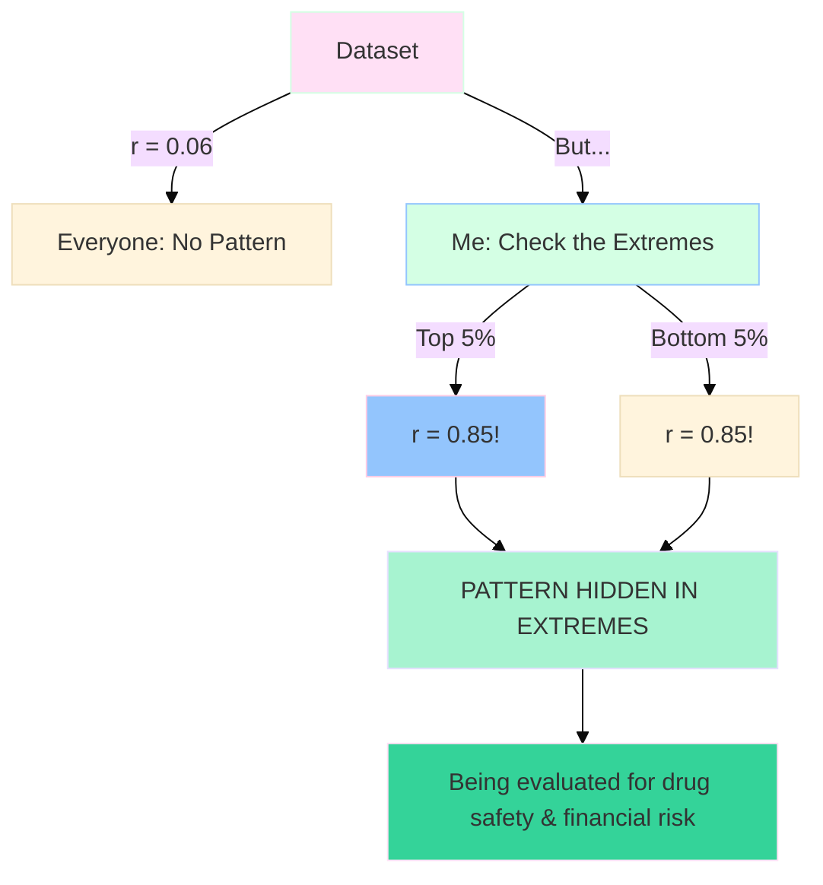

<div align="center">
 ░░▒▒▓▓██ WELCOME ██▓▓▒▒░░

<div align="center">

<picture>
  
</picture>


```
╔════════════════════════════════════════════════════════════════════════════════╗
║  A LIFE IN MISMATCHED PASTELS                                                  ║
║  Where every color combination is intentionally unexpected                     ║
║  Soft chaos with hard purpose                                                  ║
╚════════════════════════════════════════════════════════════════════════════════╝
```

<!-- The Sacred Mismatched Matrix -->
                        

<picture>
  
</picture>


</div>

---

## ░░░░░░░░ LAYER 0: WHISPER PHASE [SOFTEST MISMATCHES] ░░░░░░░░

<div align="center">

<picture>
  
</picture>

```
FDF2F8 ░░░░░░░░░░░░░░░░░░░░░░░░░░░░░░░░░░░░░░░░░░░░░░░░░░░░░░░░░░░░░░
FFE0F5 ░░░░░░░░ 2022: Lab coat meets unexpected pastels ░░░░░░░░░░░
D4FFE4 ░░░░░░░░ Where pink met mint met purpose ░░░░░░░░░░░░░░░░░░░░
```

</div>

<table align="center" width="90%">
<tr><td style="background: linear-gradient(135deg, #FFE0F5 0%, #D4FFE4 50%, #93C5FD 100%); padding: 30px; border-radius: 20px; border: 3px solid transparent;">

```yaml
Name: Cazzy A.
Current Role: Head of Data @ FoXX Health
Background: Quality Control Scientist → Ethical AI
Trajectory: Former lab scientist who traded pipettes for Python

Education: 
  - MS Data Science (University of Denver)
  - BS Integrative Biology & Chemistry (OSU Cascades)
  - AI in Healthcare Certificate (Johns Hopkins, 2025)
  
Mission: Building AI that addresses healthcare inequities for women
Specialty: Pattern discovery in distribution tails & bias detection
Philosophy: Every model must be validated, evidence-based & production-ready
Approach: Effectiveness + Attractiveness + Impact = Excellence

# My ideal palette: Mismatched pastels that shouldn't work but do
```
I started in a lab coat, where I learned that good science means obsessing over validation and reproducibility. Turns out, those habits translate pretty well to machine learning.

I’m here to make sure we are building ethical AI. In women’s health, “good enough” models still fail real people, so my work is bias audits, subgroup calibration, and ruthless validation...and then shipping tools people actually use. I like the weird edges of data: tails, drift, the places fairness breaks. I’m stubborn about ethics and practical about delivery. I’ll trade a headline metric for a safer model every time and, I’ll show you why with evidence, not vibes. Why me? I bridge research and production.  I write the tests, instrument the monitors, and say “no” when the data can’t support the claim. Bring me the messy dataset you’ve been avoiding; I’ll tell you what the tails are saying, and we’ll make it useful together. 

If you care less about hype and more about calibration curves, we’ll get along. I like turning messy data into useful, fair systems—models that explain themselves, pass their audits, and still look good in a dashboard. If you’re curious about outliers, tail behavior, and pushing code that doesn’t quietly exclude half the population, say hi.

</td></tr>
</table>

---

## ▒▒▒▒▒▒▒▒ LAYER 1: GERMINATION [THE MISMATCHED ERA] ▒▒▒▒▒▒▒▒

<div align="center">

<picture>
  
</picture>

```
D4FFE4 ▒▒▒▒▒▒▒▒▒▒▒▒▒▒▒▒▒▒▒▒▒▒▒▒▒▒▒▒▒▒▒▒▒▒▒▒▒▒▒▒▒▒▒▒▒▒▒▒▒▒▒▒▒▒
93C5FD ▒▒▒▒▒▒▒▒ 2023: Data Science emerges ▒▒▒▒▒▒▒▒▒▒▒▒▒▒▒▒▒
FFCCE5 ▒▒▒▒▒▒▒▒ 30% reduction in errors ▒▒▒▒▒▒▒▒▒▒▒▒▒▒▒▒▒▒▒▒
```

</div>

<table align="center" width="96%" style="border-collapse: separate; border-spacing: 12px;">
<tr>
<td align="center" style="background: linear-gradient(135deg, #B5E5C5 0%, #D4FFE4 100%); padding: 18px; border-radius: 18px;">

<p style="color: #059669; font-size: 14px;">Where I learned that<br>reproducibility is everything</p>
</td>
<td align="center" style="background: linear-gradient(135deg, #FFE0F5 0%, #FFE8F8 100%); padding: 18px; border-radius: 18px;">

<p style="color: #D8B5D8; font-size: 14px;">Discovered Python doesn't<br>require safety goggles</p>
</td>
<td align="center" style="background: linear-gradient(135deg, #E6E0FF 0%, #F0EBFF 100%); padding: 18px; border-radius: 18px;">

<p style="color: #A78BFA; font-size: 14px;">Promoted twice<br>Data is my love language</p>
</td>
<td align="center" style="background: linear-gradient(135deg, #93C5FD 0%, #DBEAFE 100%); padding: 18px; border-radius: 18px;">

<p style="color: #3B82F6; font-size: 14px;">Started fixing bias in<br>medical algorithms</p>
</td>
<td align="center" style="background: linear-gradient(135deg, #FFCCE5 0%, #FFD4E8 100%); padding: 18px; border-radius: 18px;">

<p style="color: #EC4899; font-size: 14px;">Now designing<br>equitable healthcare AI</p>
</td>
</tr>
</table>

---

## ▓▓▓▓▓▓▓▓ LAYER 2: GROWTH [CONFIDENT MISMATCHES] ▓▓▓▓▓▓▓▓

<div align="center">


<picture>
  
</picture>

```
A7F3D0 ▓▓▓▓▓▓▓▓▓▓▓▓▓▓▓▓▓▓▓▓▓▓▓▓▓▓▓▓▓▓▓▓▓▓▓▓▓▓▓▓▓▓▓▓▓▓▓▓▓▓▓▓▓▓
FFCCE5 ▓▓▓▓▓▓▓▓ 2024: Lead Data Scientist ▓▓▓▓▓▓▓▓▓▓▓▓▓▓▓▓▓▓
93C5FD ▓▓▓▓▓▓▓▓ Built ML platform from scratch ▓▓▓▓▓▓▓▓▓▓▓▓▓▓
```

</div>

<table align="center" width="90%">
<tr><td style="background: linear-gradient(135deg, #A7F3D0 0%, #FFCCE5 50%, #93C5FD 100%); padding: 35px; border-radius: 25px;">

```python
def career_acceleration():
    """
    The gradient mismatches intentionally.
    Knowledge compounds in unexpected colors.
    """
    timeline = {
        "2024_Q1": "Lead Data Scientist",
        "2024_Q2": "Architected frameworks",
        "2024_Q3": "AI Engineer", 
        "2025": "Head of Data",
        "gradient": "exponential",
        "palette": "Always mismatched"
    }
    return "Where patterns emerge from chaos"
```

</td></tr>
</table>

---

## ░▒▓█ MY PROJECTS [MISMATCHED MASTERPIECES] █▓▒░

<div align="center">

<picture>
  
</picture>

</div>

### SERENDIPITY FINDER [MY SIGNATURE]

<table align="center" width="95%">
<tr><td style="background: linear-gradient(135deg, #E6E0FF 0%, #FFE0F5 50%, #FFE5CC 100%); padding: 40px; border-radius: 30px;">



<div align="center">


</div>

</td></tr>
</table>

### PROJECT MATRIX [COLOR CHAOS]

<table align="center" width="100%" style="border-collapse: separate; border-spacing: 15px;">
<tr>

<td width="33%" style="background: linear-gradient(135deg, #D4FFE4 0%, #E0F5FF 100%); padding: 25px; border-radius: 20px;">
<h4 align="center">Velvet Python</h4>


```
Coverage in pastels:
░░░░░ Hello (pink)
▒▒▒▒▒ Examples (mint)
▓▓▓▓▓ Tests (yellow)
█████ 94% (lavender)
```
<p align="center" style="font-size: 13px;">Bridging the gap between "Hello World" and production code.<br/>Every pattern benchmarked.</p>
</td>


<td width="33%" style="background: linear-gradient(135deg, #FFCCE5 0%, #E6E0FF 100%); padding: 25px; border-radius: 20px;">
<h4 align="center">Mochi-Moo AI</h4>


```
147 shades of pastel:
░░░░░ Whisper (blush)
▒▒▒▒▒ Think (butter)
▓▓▓▓▓ Create (lilac)
█████ Feel (mint)
```

<p align="center" style="font-size: 13px;">An AI assistant that adapts its thinking style.<br/>Built with 147 shades of pastel.</p>
</td>

<td width="33%" style="background: linear-gradient(135deg, #93C5FD 0%, #D4FFE4 100%); padding: 25px; border-radius: 20px;">
<h4 align="center">CloudPoof Omega</h4>


```
Infrastructure softness:
░░░░░ Concept (mint)
▒▒▒▒▒ Build (peach)
▓▓▓▓▓ Deploy (sky)
█████ 12ms (sage)
```

<p align="center" style="font-size: 13px;">Infrastructure that composes itself.<br/>In mismatched pastels.</p>
</td>

</tr>
</table>

---

## ░▒▓█ TECHNICAL STACK [THE MISMATCHED COLLECTION] █▓▒░

<div align="center">

<picture>
  
</picture>

</div>

### MACHINE LEARNING & AI [MISMATCHED BY DESIGN]

<table align="center" width="95%">
<tr><td style="background: linear-gradient(180deg, #FFF8FD 0%, #FFE0F5 20%, #E6E0FF 40%, #D4FFE4 60%, #FFCCE5 80%, #FFF8FD 100%); padding: 35px; border-radius: 30px;">

```
░░░░░░░░░░░░░░░░░░░░░░░░░░░░░░░░░░░░░░░░░░░░░░░░░░░░░░░░░░░░░░░░░░░
```
<h3 align="center" style="color: #8B5CF6;">Machine Learning & AI</h3>
<p align="center" style="color: #7C3AED; font-size: 14px;">The stuff that actually ships to production</p>

<br>

<div align="center">


<br><br>


</div>

</td></tr>
</table>

### DATA SCIENCE & VISUALIZATION [BEAUTIFUL CHAOS]

<table align="center" width="95%">
<tr><td style="background: linear-gradient(180deg, #FFF8FD 0%, #DDEBFF 25%, #E6E0FF 50%, #FFCCE5 75%, #D4FFE4 100%); padding: 35px; border-radius: 30px;">

```
▒▒▒▒▒▒▒▒▒▒▒▒▒▒▒▒▒▒▒▒▒▒▒▒▒▒▒▒▒▒▒▒▒▒▒▒▒▒▒▒▒▒▒▒▒▒▒▒▒▒▒▒▒▒▒▒▒▒▒▒▒▒▒▒▒
```

<h3 align="center" style="color: #6366F1;">Data Science & Visualization</h3>
<p align="center" style="color: #7C3AED; font-size: 14px;">Where math meets aesthetics</p>

<br>

<div align="center">


<br><br>


</div>

</td></tr>
</table>

### CLOUD & INFRASTRUCTURE [UNEXPECTED COMBINATIONS]

<table align="center" width="95%">
<tr><td style="background: linear-gradient(135deg, #D4FFE4 0%, #E0F5FF 50%, #FFCCE5 100%); padding: 35px; border-radius: 30px;">

```
▓▓▓▓▓▓▓▓▓▓▓▓▓▓▓▓▓▓▓▓▓▓▓▓▓▓▓▓▓▓▓▓▓▓▓▓▓▓▓▓▓▓▓▓▓▓▓▓▓▓▓▓▓▓▓▓▓▓▓▓▓▓▓▓▓
```

<h3 align="center" style="color: #06B6D4;">Cloud & Data Engineering</h3>
<p align="center" style="color: #0891B2; font-size: 14px;">Because models need homes too</p>

<br>

<div align="center">


<br><br>


</div>

</td></tr>
</table>

### ADDITIONAL EXPLORATIONS [PASTEL PLAYGROUND]

<table align="center" width="95%">
<tr><td style="background: linear-gradient(135deg, #FFCCE5 0%, #E6E0FF 30%, #D4FFE4 60%, #DDEBFF 100%); padding: 35px; border-radius: 30px;">

```
████████████████████████████████████████████████████████████████████
```
<h3 align="center" style="color: #A855F7;">Programming Explorations</h3>
<p align="center" style="color: #9333EA; font-size: 14px;">Because learning new languages keeps me curious</p>

<br>

<div align="center">


<br><br>


</div>

</td></tr>
</table>

---

## ░▓░ STATISTICAL MASTERY [MISMATCHED METHODS] ░▓░

<div align="center">

<picture>
  
</picture>

<table align="center" width="95%">
<tr><td style="background: linear-gradient(135deg, #D4FFE4 0%, #FFE0F5 33%, #93C5FD 66%, #E6E0FF 100%); padding: 40px; border-radius: 30px;">

<h3 align="center" style="color: #0EA5E9;">Statistics & QC</h3>

<div align="center">

<!-- Intentionally mismatched combinations -->


<br><br>


<br><br>


</div>

<p align="center" style="font-size: 14px; color: #0EA5E9;">
From measuring chemical reactions to measuring algorithmic bias.<br/>
The lab coat is gone but the hypothesis testing remains.
</p>

</td></tr>
</table>

</div>

---

## ██░░ HEALTHCARE: WHERE MISMATCHES MATTER ░░██

<div align="center">

<picture>
  
</picture>

```
THE GRADIENT OF HARM:
░░░░░░░░░░░░░░░░░░░░░░░░░░░ Clinical trials exclude women
▒▒▒▒▒▒▒▒▒▒▒▒▒▒▒▒▒▒▒▒▒▒▒▒▒▒ 8/10 drugs affect women differently
▓▓▓▓▓▓▓▓▓▓▓▓▓▓▓▓▓▓▓▓▓▓▓▓▓▓ 50% higher misdiagnosis rate
████████████████████████████ Real people harmed daily

MY INTERVENTION (IN MISMATCHED PASTELS):
████████████████████████████ Detect bias (pink on mint)
▓▓▓▓▓▓▓▓▓▓▓▓▓▓▓▓▓▓▓▓▓▓▓▓▓▓ Balance data (blue on blush)
▒▒▒▒▒▒▒▒▒▒▒▒▒▒▒▒▒▒▒▒▒▒▒▒▒▒ Fair models (lavender on sage)
░░░░░░░░░░░░░░░░░░░░░░░░░░░ Healthcare for all (in every shade)
```

</div>

<table align="center" width="85%">
<tr><td style="background: linear-gradient(135deg, #FFE0F5 0%, #D4FFE4 20%, #93C5FD 40%, #FFCCE5 60%, #E6E0FF 80%, #A7F3D0 100%); padding: 35px; border-radius: 30px;">

<div align="center">

<h3>Head of Data @ FoXX Health</h3>

Leading healthcare equity initiatives<br/>
Building bias detection frameworks<br/>
Shipping models that don't exclude<br/>
<br/>
<b>All in intentionally mismatched pastels</b>

</div>

</td></tr>
</table>

---

## ░▒▓ THE MISMATCHED PHILOSOPHY ▓▒░

<div align="center">

<table align="center" width="80%">
<tr><td style="background: linear-gradient(45deg, #FFE0F5 0%, #D4FFE4 14%, #93C5FD 28%, #FFCCE5 42%, #E6E0FF 56%, #B5E5C5 70%, #C7CEFA 84%, #FFD6E8 100%); padding: 40px; border-radius: 30px;">

```
THE PASTEL BREATHING:

Inhale   ░░░░░░░░░░ Soft hypothesis      [Pink wonder]
Hold     ▒▒▒▒▒▒▒▒▒▒ Gentle validation    [Yellow patience]  
Exhale   ▓▓▓▓▓▓▓▓▓▓ Mint production      [Green growth]
Pause    ██████████ Sage impact          [Deep but soft]

This is my palette.
Mismatched but intentional.
Soft but never weak.
```


</td></tr>
</table>

</div>

---

## ████ CONTACT [WHERE MISMATCHES CONVERGE] ████

<div align="center">

<picture>
  
</picture>

<br>
<!-- START: paste outside any ``` fences --> <table align="center" width="85%"> <tr> <td style=" padding: 28px; border: 3px solid transparent; border-radius: 10px; background: linear-gradient(#FFFFFF,#FFFFFF) padding-box, linear-gradient(45deg,#FFF9FD,#F8F7FF,#F6FFFB,#F7FAFF,#FFF9F2) border-box; "> <!-- top animated pastel ombre bar --> <picture>  </picture> <!-- cute mismatched pastel badges --> <p align="center" style="margin:10px 0 8px;">    </p> <p align="center" style="margin:-4px 0 16px;">   </p> <!-- your content --> <p align="center" style="font-size:16px; color:#7C3AED; line-height:1.8; margin:0 0 14px;"> I'm always interested in conversations about pattern discovery, ethical AI, or why medical algorithms think everyone is a 70kg male. Also happy to discuss career transitions, the beauty of well-documented code, or why pastel color schemes are objectively superior. </p> <h4 align="center" style="color:#8B5CF6; margin:6px 0 8px;">Topics That Light Me Up</h4> <p align="center" style="font-size:14px; color:#6366F1; line-height:1.6; margin:0;"> Hidden patterns in data • Building fair AI systems • Healthcare innovation<br> Statistical methods that actually work • Open source collaboration<br> Making complex things simple • Women in tech • Ethical technology<br> That one bug that took three days to find (it was a typo) </p> <!-- bottom animated pastel ombre bar --> <picture>  </picture> </td> </tr> </table> <!-- END: paste outside any ``` fences -->

<br>
  
</picture>

```
░░░░░░░░░░░░░░░░░░░░░░░░░░░░░░░░░ Curious about patterns?
▒▒▒▒▒▒▒▒▒▒▒▒▒▒▒▒▒▒▒▒▒▒▒▒▒▒▒▒▒▒▒▒ Interested in fairness?
▓▓▓▓▓▓▓▓▓▓▓▓▓▓▓▓▓▓▓▓▓▓▓▓▓▓▓▓▓▓▓▓ Want to build together?
████████████████████████████████████ Let's make AI fair
```

<table align="center" width="88%" style="border-collapse: separate; border-spacing: 15px;">
<tr>
<td align="center" style="background: linear-gradient(135deg, #FFE0F5 0%, #D4FFE4 100%); padding: 18px; border-radius: 18px;">
<a href="https://linkedin.com/in/cazandra-aporbo">

</a>
</td>
<td align="center" style="background: linear-gradient(135deg, #E6E0FF 0%, #93C5FD 100%); padding: 18px; border-radius: 18px;">
<a href="https://github.com/Cazzy-Aporbo">

</a>
</td>
<td align="center" style="background: linear-gradient(135deg, #D4FFE4 0%, #FFCCE5 100%); padding: 18px; border-radius: 18px;">
<a href="mailto:becaziam@gmail.com">

</a>
</td>
<td align="center" style="background: linear-gradient(135deg, #FFCCE5 0%, #E6E0FF 100%); padding: 18px; border-radius: 18px;">
<a href="https://foxxhealth.com">

</a>
</td>
</tr>
</table>

<br>

<picture>
  
</picture>

</div>

---

## THE FINAL COMPRESSION [BEAUTIFULLY MISMATCHED]

<div align="center">


```
╔═══════════════════════════════════════════════════════════════════════════════════╗
║                                                                                   ║
║  COMPRESSION COMPLETE:                                                            ║
║                                                                                   ║
║  Career = ∫(Pink → Blue → Mint → Purpose)dt                                       ║
║                                                                                   ║
║  Every color combination intentionally unexpected                                 ║
║  Pink on mint, blue on blush, lavender on sage                                    ║
║  Mismatched but never unintentional                                               ║
║                                                                                   ║
║  I find patterns in noise                                                         ║
║  I fix bias in algorithms                                                         ║
║  I do it all in mismatched pastels                                                ║
║                                                                                   ║
║  Because different is powerful                                                    ║
║  And unexpected is memorable                                                      ║
║                                                                                   ║
╚═══════════════════════════════════════════════════════════════════════════════════╝
```

<br>

<picture>
  
</picture>

<br>

<picture>
  
</picture>

<br>

<picture>
  
</picture>

<br>

<!-- The Final Mismatched Matrix -->
                   

<br>

<div align="center" style="background: linear-gradient(135deg, #FFE0F5 0%, #E6E0FF 25%, #FFE5CC 50%, #D4FFE4 75%, #E0F5FF 100%); padding: 30px; border-radius: 30px; width: 70%; box-shadow: 0 20px 40px rgba(230, 224, 255, 0.2);">

<h3 style="color: #D8B5D8;">As a statistician specializing in outliers</h3>

```math
f⁻¹(Me) = ∅  // Unique, no inverse exists

x ∈ Outlier ∧ Skew(x) → ∞  // Infinite skewness  

P(Success) = 1 - P(Giving Up)  // Always positive
```

<br>


<br><br>

<br><br>


</div>

<!-- Centered typing line -->
<div align="center">
  <picture>
    
  </picture>
</div>

<br>

<picture>
  
</picture>

<br>

<picture>
  
</picture>

<br>

<picture>
  
</picture>

<br>

<!-- The Final Pastel Matrix -->
                        


<div align="center">

<picture>
  
</picture>
</div>
