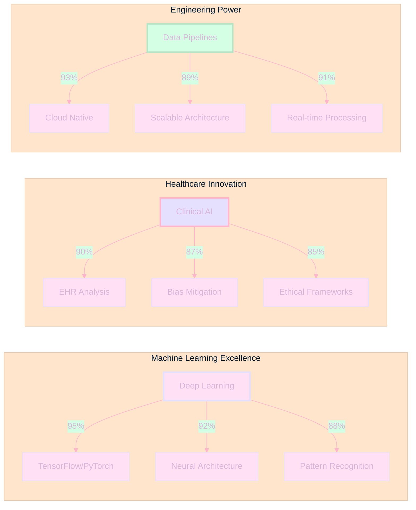
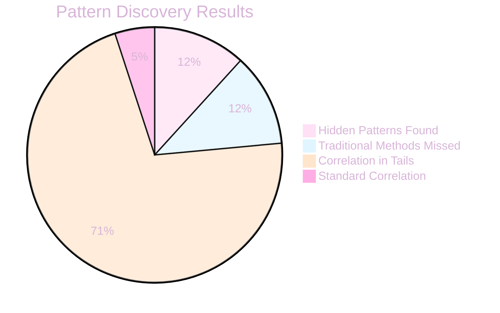
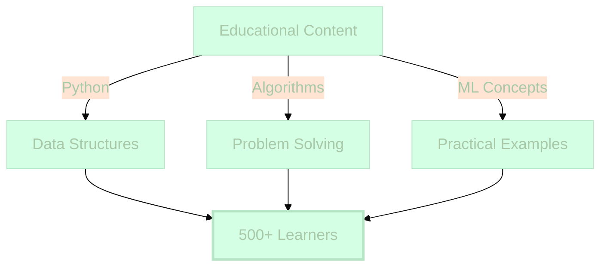
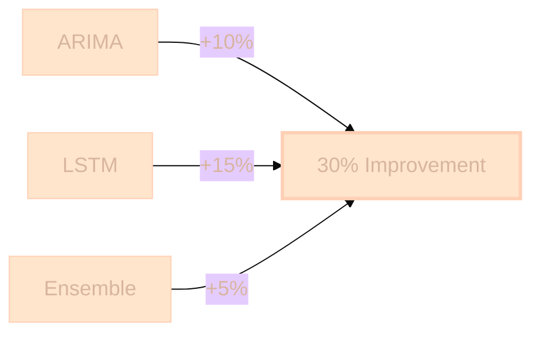
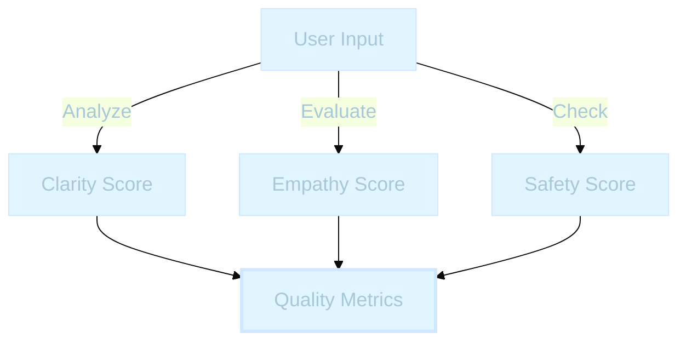
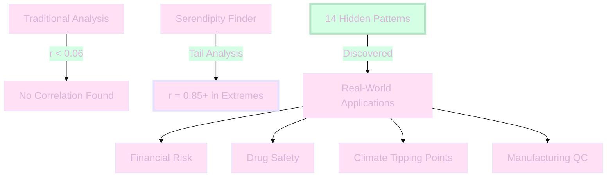

<!-- Animated Wave Header with Lavender Pink Mint Ombre -->
<picture>
  
</picture>

 

<!-- Animated Typing SVG with Pastel Colors -->
<picture>
  
</picture>

 

<!-- Professional Badges with Pastel Lavender Pink Mint -->

  
  &nbsp;
  
  &nbsp;
  

 

<!-- Animated Pastel Gradient Bar -->
<picture>
  
</picture>

 
<!-- GitHub Stats with Pastel Lavender Theme - Always Updated -->

  <!-- GitHub Stats -->
  
  &nbsp;&nbsp;
  <!-- Language Stats with Pastel Theme -->
  

 

<!-- Animated Activity Graph with Pastel Palette -->

  <picture>
    
  </picture>

 

  
<!-- Philosophy Section with Beautiful Pastel Ombre -->
<picture>
  
</picture>

 

<table align="center" width="90%" style="border-collapse: separate; border-spacing: 0 25px;">
<tr>
<td align="center" style="background: linear-gradient(135deg, #FFE0F5 0%, #E6E0FF 20%, #FFE5CC 40%, #D4FFE4 60%, #E6E0FF 80%, #FFE0F5 100%); padding:50px; border-radius:30px; box-shadow: 0 20px 40px rgba(230, 224, 255, 0.3); border: 3px solid rgba(255, 224, 245, 0.4);">

 

<picture>
  
</picture>

  

<i style="color: #C8A8C8; font-size: 17px; line-height: 1.7;">I specialize in finding hidden patterns in healthcare data, particularly in areas where traditional analysis fails. My work focuses on closing the gender gap in health data through advanced statistical methods and ethical AI development.</i>

  

<b style="color: #D8B5D8; font-size: 19px;">Cazandra Aporbo, MS</b>
 
<i style="background: linear-gradient(90deg, #FFB5CC, #E6D0FF, #B5E5C5); -webkit-background-clip: text; -webkit-text-fill-color: transparent; background-clip: text; font-size: 15px; font-weight: 600;">f⁻¹(Me) = ∅ (unique, no inverse)</i>

 

</td>
</tr>
</table>

 

<!-- Enhanced Core Competencies with Visual Progress -->

<picture>
  
</picture>

 

<picture>
  
</picture>

 

<!-- Colorful Skill Boxes with Pastel Ombre -->
<table align="center" width="92%" style="border-collapse: separate; border-spacing: 15px;">
<tr>
<td width="33%" align="center" style="background: linear-gradient(135deg, #FFE0F5 0%, #FFE8F8 100%); padding: 25px; border-radius: 20px; box-shadow: 0 15px 35px rgba(255, 224, 245, 0.25); text-align: center;">
  <h3 style="color: #D8B5D8;">Machine Learning</h3>
  
    
  Deep Learning • Neural Networks • Statistical Analysis • Pattern Recognition
</td>
<td width="33%" align="center" style="background: linear-gradient(135deg, #E6E0FF 0%, #F0EBFF 100%); padding: 25px; border-radius: 20px; box-shadow: 0 15px 35px rgba(230, 224, 255, 0.25); text-align: center;">
  <h3 style="color: #D8B5D8;">Healthcare AI</h3>
  
    
  Clinical Data • Bias Detection • Ethical AI • Women's Health
</td>
<td width="33%" align="center" style="background: linear-gradient(135deg, #D4FFE4 0%, #E0FFE8 100%); padding: 25px; border-radius: 20px; box-shadow: 0 15px 35px rgba(212, 255, 228, 0.25); text-align: center;">
  <h3 style="color: #B5D8B8;">Data Engineering</h3>
  
    
  Pipeline Design • Cloud Architecture • ETL/ELT • Big Data
</td>
</tr>
</table>

 

<picture>
  
</picture>

 

<!-- Large Beautiful Mermaid Diagram with Pastel Colors -->
<table align="center" width="88%" style="background: linear-gradient(180deg, #FFF8FD 0%, #FFE0F5 15%, #E6E0FF 30%, #FFE5CC 45%, #D4FFE4 60%, #E6E0FF 75%, #FFE0F5 90%, #FFF8FD 100%); padding: 35px; border-radius: 25px; box-shadow: 0 15px 35px rgba(230, 224, 255, 0.15);">
<tr><td align="center">

</td></tr>
</table>

 

<!-- Current Work Section with Enhanced Animations -->

<picture>
  
</picture>

 

<picture>
  
</picture>

 

<picture>
  
</picture>

 

  

<picture>
  
</picture>

 

 

<picture>
  
</picture>

 

<h2 align="center">
  
</h2>

<picture>
  
</picture>

 

<!-- Enhanced Focus Grid with Beautiful Pastel Ombre -->
<table align="center" width="94%" style="border-collapse: separate; border-spacing: 15px;">

<!-- Machine Learning Row -->
<tr>
<td colspan="3" align="center">
  
</td>
</tr>
<tr style="background: linear-gradient(90deg, #FFE0F5 0%, #FFE8F8 25%, #FFF0FA 50%, #FFE0F5 75%, #FFD8F0 100%); border-radius: 15px;">
<td width="30%" style="padding: 18px;"><strong style="color: #D8B5D8;">Machine Learning Engineering</strong></td>
<td width="50%" style="padding: 18px; color: #C8A8C8;">Building scalable models, fine-tuning deep learning, and deploying efficiently</td>
<td width="20%" style="padding: 18px;">
  
</td>
</tr>

<!-- Data Infrastructure Row -->
<tr>
<td colspan="3" align="center">
  
</td>
</tr>
<tr style="background: linear-gradient(90deg, #E6E0FF 0%, #F0EBFF 25%, #F8F5FF 50%, #E6E0FF 75%, #DED8FF 100%); border-radius: 15px;">
<td style="padding: 18px;"><strong style="color: #D8B5D8;">Data Infrastructure & Automation</strong></td>
<td style="padding: 18px; color: #C8A8C8;">Optimizing pipelines, ETL/ELT, and cloud data ecosystems</td>
<td style="padding: 18px;">
  
</td>
</tr>

<!-- AI Ethics Row -->
<tr>
<td colspan="3" align="center">
  
</td>
</tr>
<tr style="background: linear-gradient(90deg, #FFE5CC 0%, #FFECD8 25%, #FFF3E4 50%, #FFE5CC 75%, #FFDEC0 100%); border-radius: 15px;">
<td style="padding: 18px;"><strong style="color: #D8B5A0;">Bias & Fairness in AI</strong></td>
<td style="padding: 18px; color: #C8A890;">Designing evaluation pipelines for LLMs in healthcare</td>
<td style="padding: 18px;">
  
</td>
</tr>

<!-- Compliance Row -->
<tr>
<td colspan="3" align="center">
  
</td>
</tr>
<tr style="background: linear-gradient(90deg, #D4FFE4 0%, #DCFFE8 25%, #E4FFEC 50%, #D4FFE4 75%, #CCFFD8 100%); border-radius: 15px;">
<td style="padding: 18px;"><strong style="color: #B5D8B8;">AI Governance & Compliance</strong></td>
<td style="padding: 18px; color: #A8C8A8;">Applying HIPAA, GDPR, FDA guidance, EU AI Act</td>
<td style="padding: 18px;">
  
</td>
</tr>

<!-- Healthcare Models Row -->
<tr>
<td colspan="3" align="center">
  
</td>
</tr>
<tr style="background: linear-gradient(90deg, #FFCCE5 0%, #FFD4E8 25%, #FFDCEB 50%, #FFCCE5 75%, #FFC4E0 100%); border-radius: 15px;">
<td style="padding: 18px;"><strong style="color: #D8B5D8;">Healthcare Models</strong></td>
<td style="padding: 18px; color: #C8A8C8;">Modeling biological, behavioral, and lifestyle data together</td>
<td style="padding: 18px;">
  
</td>
</tr>

<!-- Serendipity Finder Row -->
<tr>
<td colspan="3" align="center">
  
</td>
</tr>
<tr style="background: linear-gradient(90deg, #E0F5FF 0%, #E8F8FF 25%, #F0FAFF 50%, #E0F5FF 75%, #D8F0FF 100%); border-radius: 15px;">
<td style="padding: 18px;"><strong style="color: #A8C8D8;">Pattern Discovery in Extremes</strong></td>
<td style="padding: 18px; color: #98B8C8;">Developed Serendipity Finder methodology for tail correlation analysis</td>
<td style="padding: 18px;">
  
</td>
</tr>

</table>

 

<!-- Project Showcase with Enhanced Pastel Cards -->

<picture>
  
</picture>

 

<h2 align="center">
  
</h2>

<strong>Interactive Project Gallery (Click to Explore)</strong>

 

<!-- Enhanced Project Cards with Beautiful Pastel Ombre -->
<table align="center" width="95%" style="border-collapse: separate; border-spacing: 20px;">

<!-- Serendipity Finder Card -->
<tr>
<td align="center" style="background: linear-gradient(135deg, #E6E0FF 0%, #F0EBFF 20%, #FFE0F5 40%, #FFE8F8 60%, #E6E0FF 80%, #DED8FF 100%); padding: 35px; border-radius: 25px; box-shadow: 0 20px 45px rgba(230, 224, 255, 0.25);">

<h3 align="center">
  
</h3>

 

 

<strong style="color: #D8B5D8;">Technology:</strong> Python, D3.js, Statistical Analysis 
<strong style="color: #D8B5D8;">Impact:</strong> Found 14 patterns invisible to traditional correlation—still surprised this worked  
 
&nbsp;

</td>
</tr>

<!-- CNN Classifier Card -->
<tr>
<td align="center" style="background: linear-gradient(135deg, #FFE0F5 0%, #FFE8F8 20%, #FFCCE5 40%, #FFD4E8 60%, #FFE0F5 80%, #FFDCEB 100%); padding: 35px; border-radius: 25px; box-shadow: 0 20px 45px rgba(255, 224, 245, 0.25);">

<h3 align="center">
  
</h3>

 

 

<strong style="color: #D8B5D8;">Technology:</strong> TensorFlow, Keras, OpenCV 
<strong style="color: #D8B5D8;">Performance:</strong> 95% accuracy (took many iterations to get there)  
 
&nbsp;

</td>
</tr>

<!-- Educational Repository - Curious Coder -->
<tr>
<td align="center" style="background: linear-gradient(135deg, #D4FFE4 0%, #E0FFE8 20%, #B5E5C5 40%, #C5F5D5 60%, #D4FFE4 80%, #E8FFEC 100%); padding: 35px; border-radius: 25px; box-shadow: 0 20px 45px rgba(212, 255, 228, 0.25);">

<h3 align="center">
  
</h3>

 

 

<strong style="color: #B5D8B8;">Purpose:</strong> Teaching data science and coding concepts through practical examples 
<strong style="color: #B5D8B8;">Impact:</strong> Helping aspiring developers build strong foundations in programming  
 
&nbsp;

</td>
</tr>

<!-- Stock Market Forecasting Card -->
<tr>
<td align="center" style="background: linear-gradient(135deg, #FFE5CC 0%, #FFECD8 20%, #FFD0B5 40%, #FFD8C0 60%, #FFE5CC 80%, #FFF3E4 100%); padding: 35px; border-radius: 25px; box-shadow: 0 20px 45px rgba(255, 229, 204, 0.25);">

<h3 align="center">
  
</h3>

 

 

<strong style="color: #D8B5A0;">Technology:</strong> ARIMA, LSTM, Pandas 
<strong style="color: #D8B5A0;">Result:</strong> 30% improvement over baseline  
 
&nbsp;

</td>
</tr>

<!-- Data Pipeline Card -->
<tr>
<td align="center" style="background: linear-gradient(135deg, #FFCCE5 0%, #FFD4E8 20%, #FFB5D8 40%, #FFC0DC 60%, #FFCCE5 80%, #FFDCEB 100%); padding: 35px; border-radius: 25px; box-shadow: 0 20px 45px rgba(255, 204, 229, 0.25);">

<h3 align="center">
  
</h3>

 

 

<strong style="color: #D8B5D8;">Technology:</strong> SQL, Airflow, AWS Lambda 
<strong style="color: #D8B5D8;">Achievement:</strong> Reduced manual ops by 70% (team was very happy)  
 
&nbsp;

</td>
</tr>

<!-- Women's Health LLM Dashboard Card -->
<tr>
<td align="center" style="background: linear-gradient(135deg, #E0F5FF 0%, #E8F8FF 20%, #D0E8FF 40%, #D8F0FF 60%, #E0F5FF 80%, #F0FAFF 100%); padding: 35px; border-radius: 25px; box-shadow: 0 20px 45px rgba(224, 245, 255, 0.25);">

<h3 align="center">
  
</h3>

 

 

<strong style="color: #A8C8D8;">Technology:</strong> LangChain, Vertex AI, FastAPI, React 
<strong style="color: #A8C8D8;">Innovation:</strong> Finally—measurable AI quality scores  
 
&nbsp;

</td>
</tr>

<!-- AI Compliance Matrix Card -->
<tr>
<td align="center" style="background: linear-gradient(135deg, #FFE0F5 0%, #E6E0FF 20%, #FFE5CC 40%, #D4FFE4 60%, #E0F5FF 80%, #FFE0F5 100%); padding: 35px; border-radius: 25px; box-shadow: 0 20px 45px rgba(255, 224, 245, 0.25);">

<h3 align="center">
  
</h3>

 

 

<strong style="color: #D8B5D8;">Technology:</strong> GCP, HIPAA/GDPR frameworks 
<strong style="color: #D8B5D8;">Achievement:</strong> Made lawyers smile (rare achievement)  
 
&nbsp;

</td>
</tr>

</table>

 

<!-- Enhanced Technical Stack with Beautiful Pastel Ombre -->

<picture>
  
</picture>

 

<!-- Beautiful Skill Categories with Pastel Ombre -->
<table align="center" width="90%" style="background: linear-gradient(180deg, #FFF8FD 0%, #FFE0F5 10%, #E6E0FF 20%, #FFE5CC 30%, #D4FFE4 40%, #E0F5FF 50%, #FFCCE5 60%, #E6E0FF 70%, #FFE0F5 80%, #FFE5CC 90%, #FFF8FD 100%); padding: 40px; border-radius: 30px; box-shadow: 0 25px 50px rgba(230, 224, 255, 0.2);">

<tr><td align="center">

 

**Core Languages & Frameworks**

 

<table width="100%" align="center" style="border-collapse: separate; border-spacing: 10px;">
<tr>
<td align="center" style="background: linear-gradient(135deg, #FFE0F5 0%, #FFE8F8 100%); padding: 15px; border-radius: 15px;">
  
</td>
<td align="center" style="background: linear-gradient(135deg, #E6E0FF 0%, #F0EBFF 100%); padding: 15px; border-radius: 15px;">
  
</td>
<td align="center" style="background: linear-gradient(135deg, #FFE5CC 0%, #FFECD8 100%); padding: 15px; border-radius: 15px;">
  
</td>
<td align="center" style="background: linear-gradient(135deg, #D4FFE4 0%, #E0FFE8 100%); padding: 15px; border-radius: 15px;">
  
</td>
</tr>
</table>

  

**Machine Learning & AI**

 

<table width="100%" align="center" style="border-collapse: separate; border-spacing: 10px;">
<tr>
<td align="center" style="background: linear-gradient(135deg, #FFCCE5 0%, #FFD4E8 100%); padding: 15px; border-radius: 15px;">
  
</td>
<td align="center" style="background: linear-gradient(135deg, #E6E0FF 0%, #F0EBFF 100%); padding: 15px; border-radius: 15px;">
  
</td>
<td align="center" style="background: linear-gradient(135deg, #FFE0F5 0%, #FFE8F8 100%); padding: 15px; border-radius: 15px;">
  
</td>
<td align="center" style="background: linear-gradient(135deg, #D4FFE4 0%, #E0FFE8 100%); padding: 15px; border-radius: 15px;">
  
</td>
</tr>
<tr>
<td align="center" style="background: linear-gradient(135deg, #FFE5CC 0%, #FFECD8 100%); padding: 15px; border-radius: 15px;">
  
</td>
<td align="center" style="background: linear-gradient(135deg, #E0F5FF 0%, #E8F8FF 100%); padding: 15px; border-radius: 15px;">
  
</td>
<td align="center" style="background: linear-gradient(135deg, #FFCCE5 0%, #FFD4E8 100%); padding: 15px; border-radius: 15px;">
  
</td>
<td align="center" style="background: linear-gradient(135deg, #E6E0FF 0%, #F0EBFF 100%); padding: 15px; border-radius: 15px;">
  
</td>
</tr>
</table>

  

**Cloud & Infrastructure**

 

<table width="100%" align="center" style="border-collapse: separate; border-spacing: 10px;">
<tr>
<td align="center" style="background: linear-gradient(135deg, #D4FFE4 0%, #E0FFE8 100%); padding: 15px; border-radius: 15px;">
  
</td>
<td align="center" style="background: linear-gradient(135deg, #FFE0F5 0%, #FFE8F8 100%); padding: 15px; border-radius: 15px;">
  
</td>
<td align="center" style="background: linear-gradient(135deg, #E6E0FF 0%, #F0EBFF 100%); padding: 15px; border-radius: 15px;">
  
</td>
<td align="center" style="background: linear-gradient(135deg, #FFE5CC 0%, #FFECD8 100%); padding: 15px; border-radius: 15px;">
  
</td>
</tr>
<tr>
<td align="center" style="background: linear-gradient(135deg, #FFCCE5 0%, #FFD4E8 100%); padding: 15px; border-radius: 15px;">
  
</td>
<td align="center" style="background: linear-gradient(135deg, #D4FFE4 0%, #E0FFE8 100%); padding: 15px; border-radius: 15px;">
  
</td>
<td align="center" style="background: linear-gradient(135deg, #E0F5FF 0%, #E8F8FF 100%); padding: 15px; border-radius: 15px;">
  
</td>
<td align="center" style="background: linear-gradient(135deg, #FFE0F5 0%, #FFE8F8 100%); padding: 15px; border-radius: 15px;">
  
</td>
</tr>
</table>

  

**Data Visualization & Frontend**

 

<table width="100%" align="center" style="border-collapse: separate; border-spacing: 10px;">
<tr>
<td align="center" style="background: linear-gradient(135deg, #E0F5FF 0%, #E8F8FF 100%); padding: 15px; border-radius: 15px;">
  
</td>
<td align="center" style="background: linear-gradient(135deg, #FFE0F5 0%, #FFE8F8 100%); padding: 15px; border-radius: 15px;">
  
</td>
<td align="center" style="background: linear-gradient(135deg, #E6E0FF 0%, #F0EBFF 100%); padding: 15px; border-radius: 15px;">
  
</td>
<td align="center" style="background: linear-gradient(135deg, #D4FFE4 0%, #E0FFE8 100%); padding: 15px; border-radius: 15px;">
  
</td>
</tr>
</table>

 

</td></tr>
</table>

 

<!-- Data Science Expertise Section with Enhanced Tables -->

<picture>
  
</picture>

 

<h2 align="center">
  
</h2>

<picture>
  
</picture>

 

<h3 align="center">
  
</h3>

<!-- Beautiful Enhanced Dataset Table with Pastel Ombre -->
<table align="center" width="95%" style="border-collapse: separate; border-spacing: 16px;">

<tr>
<td colspan="5" align="center" style="padding: 25px;">
  <picture>
    
  </picture>
</td>
</tr>

<tr style="background: linear-gradient(135deg, #FFE0F5 0%, #E6E0FF 50%, #FFE5CC 100%); height: 70px;">
<td width="18%" align="center" style="padding: 15px; font-weight: bold; color: #D8B5D8;">Domain</td>
<td width="22%" align="center" style="padding: 15px; font-weight: bold; color: #D8B5D8;">Dataset/Source</td>
<td width="25%" align="center" style="padding: 15px; font-weight: bold; color: #D8B5D8;">Question</td>
<td width="20%" align="center" style="padding: 15px; font-weight: bold; color: #D8B5D8;">Methods</td>
<td width="15%" align="center" style="padding: 15px; font-weight: bold; color: #D8B5D8;">Outcome</td>
</tr>

<tr style="background: linear-gradient(90deg, #FFE0F5 0%, #FFE8F8 50%, #FFF0FA 100%); border-radius: 10px;">
<td style="padding: 15px; color: #D8B5D8;"><strong>City Health</strong></td>
<td style="padding: 15px; color: #C8A8C8;">LA/NYC/Chicago Open Data, CDC PLACES, EPA</td>
<td style="padding: 15px; color: #C8A8C8;">Air quality x chronic conditions correlation</td>
<td style="padding: 15px; color: #C8A8C8;">Spatial joins, causal forests</td>
<td style="padding: 15px;" align="center">
  
</td>
</tr>

<tr style="background: linear-gradient(90deg, #E6E0FF 0%, #F0EBFF 50%, #F8F5FF 100%); border-radius: 10px;">
<td style="padding: 15px; color: #D8B5D8;"><strong>Women's Health</strong></td>
<td style="padding: 15px; color: #C8A8C8;">De-identified EHR, symptom timelines</td>
<td style="padding: 15px; color: #C8A8C8;">Differential outcomes across life stages</td>
<td style="padding: 15px; color: #C8A8C8;">Survival analysis, uplift modeling</td>
<td style="padding: 15px;" align="center">
  
</td>
</tr>

<tr style="background: linear-gradient(90deg, #D4FFE4 0%, #E0FFE8 50%, #ECFFEF 100%); border-radius: 10px;">
<td style="padding: 15px; color: #B5D8B8;"><strong>Hospital Ops</strong></td>
<td style="padding: 15px; color: #A8C8A8;">Admissions, LOS, readmissions</td>
<td style="padding: 15px; color: #A8C8A8;">Reduce avoidable readmissions</td>
<td style="padding: 15px; color: #A8C8A8;">XGBoost, SHAP explanations</td>
<td style="padding: 15px;" align="center">
  
</td>
</tr>

<tr style="background: linear-gradient(90deg, #FFE5CC 0%, #FFECD8 50%, #FFF3E4 100%); border-radius: 10px;">
<td style="padding: 15px; color: #D8B5A0;"><strong>Behavioral Health</strong></td>
<td style="padding: 15px; color: #C8A890;">PHQ-9, GAD-7 assessment series</td>
<td style="padding: 15px; color: #C8A890;">Trajectory prediction for intervention</td>
<td style="padding: 15px; color: #C8A890;">State-space models, changepoint</td>
<td style="padding: 15px;" align="center">
  
</td>
</tr>

<tr style="background: linear-gradient(90deg, #FFCCE5 0%, #FFD4E8 50%, #FFDCEB 100%); border-radius: 10px;">
<td style="padding: 15px; color: #D8B5D8;"><strong>Vaccination Access</strong></td>
<td style="padding: 15px; color: #C8A8C8;">County/tract indicators, SDOH</td>
<td style="padding: 15px; color: #C8A8C8;">Access factors x uptake patterns</td>
<td style="padding: 15px; color: #C8A8C8;">Propensity weighting, GLMs</td>
<td style="padding: 15px;" align="center">
  
</td>
</tr>

<tr style="background: linear-gradient(90deg, #E0F5FF 0%, #E8F8FF 50%, #F0FAFF 100%); border-radius: 10px;">
<td style="padding: 15px; color: #A8C8D8;"><strong>Mobility & Exposure</strong></td>
<td style="padding: 15px; color: #98B8C8;">Mobility indexes, weather/climate</td>
<td style="padding: 15px; color: #98B8C8;">Exposure x acute event interaction</td>
<td style="padding: 15px; color: #98B8C8;">Time series decomposition</td>
<td style="padding: 15px;" align="center">
  
</td>
</tr>

</table>

 

<h3 align="center">
  
</h3>

<!-- Enhanced Analysis Patterns Table with Beautiful Pastel Ombre -->
<table align="center" width="94%" style="border-collapse: separate; border-spacing: 14px;">

<tr>
<td colspan="4" align="center" style="padding: 25px;">
  <picture>
    
  </picture>
</td>
</tr>

<tr style="background: linear-gradient(135deg, #D4FFE4 0%, #FFE5CC 50%, #E6E0FF 100%); font-weight: bold;">
<td width="25%" style="padding: 15px; color: #D8B5D8;">Pattern</td>
<td width="30%" style="padding: 15px; color: #D8B5D8;">When I Use It</td>
<td width="25%" style="padding: 15px; color: #D8B5D8;">What I Deliver</td>
<td width="20%" align="center" style="padding: 15px; color: #D8B5D8;">Skills Display</td>
</tr>

<tr style="background: linear-gradient(90deg, #E6E0FF 0%, #F0EBFF 50%, #F8F5FF 100%); border-radius: 10px;">
<td style="padding: 15px; color: #D8B5D8;"><strong>Tail Correlation Search</strong></td>
<td style="padding: 15px; color: #C8A8C8;">When averages hide extremes</td>
<td style="padding: 15px; color: #C8A8C8;">Stable tail associations</td>
<td style="padding: 15px;" align="center">
  
</td>
</tr>

<tr style="background: linear-gradient(90deg, #FFE0F5 0%, #FFE8F8 50%, #FFF0FA 100%); border-radius: 10px;">
<td style="padding: 15px; color: #D8B5D8;"><strong>Hierarchical Modeling</strong></td>
<td style="padding: 15px; color: #C8A8C8;">Multi-level data structures</td>
<td style="padding: 15px; color: #C8A8C8;">Pooled estimates with intervals</td>
<td style="padding: 15px;" align="center">
  
</td>
</tr>

<tr style="background: linear-gradient(90deg, #D4FFE4 0%, #E0FFE8 50%, #ECFFEF 100%); border-radius: 10px;">
<td style="padding: 15px; color: #B5D8B8;"><strong>Causal Effects</strong></td>
<td style="padding: 15px; color: #A8C8A8;">Beyond correlation</td>
<td style="padding: 15px; color: #A8C8A8;">Effect sizes with diagnostics</td>
<td style="padding: 15px;" align="center">
  
</td>
</tr>

<tr style="background: linear-gradient(90deg, #FFE5CC 0%, #FFECD8 50%, #FFF3E4 100%); border-radius: 10px;">
<td style="padding: 15px; color: #D8B5A0;"><strong>Time Series Anomalies</strong></td>
<td style="padding: 15px; color: #C8A890;">Seasonal patterns & shocks</td>
<td style="padding: 15px; color: #C8A890;">Forecasts with confidence</td>
<td style="padding: 15px;" align="center">
  
</td>
</tr>

<tr style="background: linear-gradient(90deg, #FFCCE5 0%, #FFD4E8 50%, #FFDCEB 100%); border-radius: 10px;">
<td style="padding: 15px; color: #D8B5D8;"><strong>Geospatial Rigor</strong></td>
<td style="padding: 15px; color: #C8A8C8;">Location-aware analysis</td>
<td style="padding: 15px; color: #C8A8C8;">Leakage-safe CV folds</td>
<td style="padding: 15px;" align="center">
  
</td>
</tr>

</table>

 

<h3 align="center">
  
</h3>

 

<picture>
  
</picture>

<table align="center" width="85%" style="background: linear-gradient(135deg, #FFE0F5 0%, #E6E0FF 15%, #FFE5CC 30%, #D4FFE4 45%, #E0F5FF 60%, #FFCCE5 75%, #FFE0F5 90%, #E6E0FF 100%); padding: 45px; border-radius: 30px; box-shadow: 0 25px 50px rgba(230, 224, 255, 0.18);">
<tr><td align="center">

 

<picture>
  
</picture>

 

  

<picture>
  
</picture>

 

  

<picture>
  
</picture>

 

  

<picture>
  
</picture>

 

 

</td></tr>
</table>

<picture>
  
</picture>

 

<!-- Enhanced Serendipity Finder Section with Pastel Ombre -->

<picture>
  
</picture>

 

<a href="https://github.com/Cazzy-Aporbo/Serendipity-Finder">
  <picture>
    
  </picture>
</a>

  

<table align="center" width="85%" style="background: linear-gradient(135deg, #E6E0FF 0%, #FFE0F5 12%, #FFE5CC 24%, #D4FFE4 36%, #E0F5FF 48%, #FFCCE5 60%, #E6E0FF 72%, #FFE0F5 84%, #FFE5CC 96%, #D4FFE4 100%); padding: 35px; border-radius: 25px; margin: 30px 0; box-shadow: 0 18px 36px rgba(230, 224, 255, 0.15);">
<tr><td align="center">

</td></tr>
</table>

 

<picture>
  
</picture>

 

  

 

<!-- Professional Experience Timeline with Enhanced Pastel Ombre -->

<picture>
  
</picture>

 

<table align="center" width="90%" style="border-collapse: separate; border-spacing: 0 25px;">

<tr>
<td width="100%" align="center" style="background: linear-gradient(90deg, #FFE0F5 0%, #E6E0FF 25%, #FFE5CC 50%, #D4FFE4 75%, #E0F5FF 100%); padding: 8px; border-radius: 15px;">
  
</td>
</tr>

<tr>
<td align="center" style="background: linear-gradient(135deg, #FFE0F5 0%, #FFE8F8 20%, #FFCCE5 40%, #FFD4E8 60%, #FFE0F5 80%, #FFE8F8 100%); padding: 25px; border-radius: 20px; box-shadow: 0 12px 28px rgba(255, 224, 245, 0.15);">
<strong style="font-size: 19px; color: #D8B5D8;">Head of Data</strong> | FoXX Health  
  
Leading data strategy • Building inclusive AI systems • Closing gender gaps in healthcare data
</td>
</tr>

<tr>
<td width="100%" align="center" style="background: linear-gradient(90deg, #E6E0FF 0%, #FFE0F5 25%, #D4FFE4 50%, #FFE5CC 75%, #E0F5FF 100%); padding: 8px; border-radius: 15px;">
  
</td>
</tr>

<tr>
<td align="center" style="background: linear-gradient(135deg, #E6E0FF 0%, #F0EBFF 20%, #E6E0FF 40%, #DED8FF 60%, #E6E0FF 80%, #F0EBFF 100%); padding: 25px; border-radius: 20px; box-shadow: 0 12px 28px rgba(230, 224, 255, 0.2);">
<strong style="font-size: 19px; color: #D8B5D8;">Data Scientist</strong> | A Better Life Appliance Repair  
  
Optimized operations • Predictive maintenance models • Customer analytics
</td>
</tr>

<tr>
<td width="100%" align="center" style="background: linear-gradient(90deg, #D4FFE4 0%, #FFE5CC 25%, #E6E0FF 50%, #FFE0F5 75%, #FFCCE5 100%); padding: 8px; border-radius: 15px;">
  
</td>
</tr>

<tr>
<td align="center" style="background: linear-gradient(135deg, #D4FFE4 0%, #E0FFE8 20%, #D4FFE4 40%, #CCFFD8 60%, #D4FFE4 80%, #E0FFE8 100%); padding: 25px; border-radius: 20px; box-shadow: 0 12px 28px rgba(212, 255, 228, 0.15);">
<strong style="font-size: 19px; color: #B5D8B8;">Mentor & Tutor</strong> | STEM Education  
  
Teaching data science • Guiding career transitions • Fostering technical excellence
</td>
</tr>

</table>

 

<!-- Enhanced Academic Background with Pastel Ombre -->

<picture>
  
</picture>

 

<table align="center" width="85%" style="border-collapse: separate; border-spacing: 25px;">
<tr>
<td width="50%" align="center" style="background: linear-gradient(135deg, #E6E0FF 0%, #F0EBFF 35%, #E6E0FF 70%, #DED8FF 100%); padding: 30px; border-radius: 20px; box-shadow: 0 15px 32px rgba(230, 224, 255, 0.18);">
  
    
  
    
  Advanced Statistics • Machine Learning • Data Engineering
</td>
<td width="50%" align="center" style="background: linear-gradient(135deg, #FFE5CC 0%, #FFECD8 35%, #FFE5CC 70%, #FFD0B5 100%); padding: 30px; border-radius: 20px; box-shadow: 0 15px 32px rgba(255, 229, 204, 0.18);">
  
    
  
    
  Biological Systems • Chemical Analysis • Research Methods
</td>
</tr>
<tr>
<td colspan="2" align="center" style="background: linear-gradient(135deg, #D4FFE4 0%, #E0FFE8 35%, #D4FFE4 70%, #CCFFD8 100%); padding: 30px; border-radius: 20px; box-shadow: 0 15px 32px rgba(212, 255, 228, 0.18);">
  
    
  
    
  AI Compliance • Healthcare Analytics • Data Governance • Ethical AI in Healthcare
</td>
</tr>
</table>

 

<picture>
  
</picture>

 

<!-- Mission Section with Maximum Pastel Ombre Beauty -->

<picture>
  
</picture>

 

<table align="center" width="85%" style="background: linear-gradient(135deg, #FFE0F5 0%, #FFE8F8 8%, #E6E0FF 16%, #F0EBFF 24%, #FFE5CC 32%, #FFECD8 40%, #D4FFE4 48%, #E0FFE8 56%, #E0F5FF 64%, #E8F8FF 72%, #FFCCE5 80%, #FFD4E8 88%, #FFE0F5 96%, #E6E0FF 100%); padding: 42px; border-radius: 30px; box-shadow: 0 25px 50px rgba(230, 224, 255, 0.18);">
<tr><td align="center">

 

<picture>
  
</picture>

  

Most medical research historically excluded women, and AI trained on biased data perpetuates these gaps. At FoXX Health, I'm working to fix this—building comprehensive healthcare models that represent women's health accurately.

 

It's challenging work. Healthcare data is messy, regulations are complex, and stakes are high. But when you build something that helps identify a condition years earlier, or prevents an adverse reaction, or simply makes someone feel heard by the healthcare system—that's worth the late nights debugging.

  

&nbsp;&nbsp;

&nbsp;&nbsp;

 

</td></tr>
</table>

 

<!-- Let's Connect Section with Ultimate Pastel Ombre -->

<picture>
  
</picture>

 

<table align="center" width="85%" style="background: linear-gradient(135deg, #FFE0F5 0%, #FFE8F8 10%, #E6E0FF 20%, #F0EBFF 30%, #FFE5CC 40%, #FFECD8 50%, #D4FFE4 60%, #E0FFE8 70%, #E0F5FF 80%, #E8F8FF 90%, #FFCCE5 100%); padding: 40px; border-radius: 30px; box-shadow: 0 20px 42px rgba(230, 224, 255, 0.12);">
<tr><td align="center">

 

**I'm always excited to discuss:**

  

<picture>
  
</picture>

 

</td></tr>
</table>

  

<!-- Enhanced Contact Buttons with Pastel Ombre -->
<table align="center" width="85%" style="border-collapse: separate; border-spacing: 15px;">
<tr>
<td align="center" style="background: linear-gradient(135deg, #FFE0F5 0%, #FFE8F8 100%); padding: 20px; border-radius: 20px;">
  
</td>
<td align="center" style="background: linear-gradient(135deg, #E6E0FF 0%, #F0EBFF 100%); padding: 20px; border-radius: 20px;">
  
</td>
</tr>
<tr>
<td align="center" style="background: linear-gradient(135deg, #D4FFE4 0%, #E0FFE8 100%); padding: 20px; border-radius: 20px;">
  
</td>
<td align="center" style="background: linear-gradient(135deg, #FFE5CC 0%, #FFECD8 100%); padding: 20px; border-radius: 20px;">
  
</td>
</tr>
<tr>
<td colspan="2" align="center" style="background: linear-gradient(135deg, #FFCCE5 0%, #FFD4E8 100%); padding: 20px; border-radius: 20px;">
  
</td>
</tr>
</table>

 

<!-- Contribution Statistics with Pastel Theme -->

<picture>
  
</picture>

 
 

  <picture>
    
  </picture>

 

<!-- License Section with Beautiful Pastel Ombre -->

<picture>
  
</picture>

 

<table align="center" width="78%" style="border-collapse: separate; border-spacing: 20px;">
<tr>
<td width="50%" align="center" style="background: linear-gradient(135deg, #FFE0F5 0%, #FFE8F8 25%, #FFCCE5 50%, #FFD4E8 75%, #FFE0F5 100%); padding: 25px; border-radius: 20px; box-shadow: 0 16px 35px rgba(255, 224, 245, 0.18);">
  
    
  <strong style="color: #D8B5D8;">Open Source Code</strong> 
  Free to use, modify, and distribute
</td>
<td width="50%" align="center" style="background: linear-gradient(135deg, #E6E0FF 0%, #F0EBFF 25%, #E6E0FF 50%, #DED8FF 75%, #E6E0FF 100%); padding: 25px; border-radius: 20px; box-shadow: 0 16px 35px rgba(230, 224, 255, 0.2);">
  
    
  <strong style="color: #D8B5D8;">Documentation</strong> 
  Share and adapt with attribution
</td>
</tr>
</table>

 

 

<!-- Footer with Ultimate Pastel Ombre Wave -->

<picture>
  
</picture>

<picture>
  
</picture>

  

  
  
  

  
  
  

  
    
  
  <picture>
    
  </picture>

 

<!-- Profile Views Counter with Dynamic Update -->

<!-- Last Updated Badge -->

