```mermaid
%%{init: {'theme':'base',
  'flowchart': {'curve':'basis'},
  'themeVariables': {
    'fontSize':'14px',
    'textColor':'#64748B',          /* slate-500 */
    'lineColor':'#E9D5FF',          /* violet-200 */
    'background':'#FFFAFE',         /* blush-50 */
    'mainBkg':'#FFFFFF',
    'primaryColor':'#FDF2F8',       /* pink-100 */
    'primaryBorderColor':'#E9D5FF', /* violet-200 */
    'tertiaryColor':'#ECFEFF',      /* cyan-50 */
    'clusterBkg':'#FAF5FF',         /* fuchsia-50 */
    'clusterBorder':'#E9D5FF',
    'radius':12
}}}%%
graph TB

%% pastel classes (mismatched, all very light)
classDef pink  fill:#FDF2F8,stroke:#FBCFE8,stroke-width:2px,color:#6B7280;
classDef lilac fill:#F5F3FF,stroke:#DDD6FE,stroke-width:2px,color:#6B7280;
classDef mint  fill:#ECFDF5,stroke:#BBF7D0,stroke-width:2px,color:#475569;
classDef sky   fill:#F0F9FF,stroke:#BAE6FD,stroke-width:2px,color:#475569;

subgraph "Technical Mastery · 95%"
  ML[Machine Learning<br/>TensorFlow · PyTorch<br/>95%]
  DS[Data Science<br/>Stats & Analysis<br/>93%]
  AI[AI Engineering<br/>LLMs · NLP<br/>90%]
  PY[Python Lover<br/>4+ years<br/>98%]
end

subgraph "Healthcare AI Expertise · 90%"
  HC[Clinical AI<br/>EHR · FHIR<br/>90%]
  ET[Ethics & Bias<br/>Fairness Metrics<br/>92%]
  WH[Women's Health<br/>Specialized Models<br/>88%]
  CO[Compliance<br/>HIPAA · GDPR · FDA<br/>85%]
end

subgraph "Cloud & Scale · 88%"
  CL[Cloud Architecture<br/>AWS · GCP · Azure<br/>88%]
  DP[Data Pipelines<br/>Airflow · Spark<br/>93%]
  RT[Real-time Systems<br/>Kafka · Redis<br/>91%]
  SC[Scale Systems<br/>K8s · Docker<br/>89%]
end

%% assign cute mismatched pastels
class ML,ET,CL pink
class DS,HC,DP lilac
class AI,WH,RT mint
class PY,CO,SC sky

```

<div align="center">

<!-- Animated Wave Header with Enhanced Gradient -->
<picture>
  
</picture>

<!-- Profile Stats with Mismatched Colors -->
<p align="center">
  
  
  
</p>

<br>

<!-- Animated Typing Introduction -->
<picture>
  
</picture>

<br>

<!-- Animated Gradient Line -->
<!-- Option C: Cool Haze (icy lilac → sky → mint, ultra pale) -->
<picture>
  
</picture>

<div align="center">
  
  &nbsp;
  
  &nbsp;
  
</div>

</div>

<br>

<!-- ═══════════════════════════════════════════════════════════════════════════════════════════ -->
<!-- ABOUT ME SECTION -->
<!-- ═══════════════════════════════════════════════════════════════════════════════════════════ -->

<div align="center">

<picture>
  
</picture>

<br>

<!-- Professional Summary Card -->
<table align="center" width="90%">
<tr><td style="background: linear-gradient(135deg, #FFE0F5 0%, #E6E0FF 50%, #D4FFE4 100%); padding: 35px; border-radius: 25px; border: 3px solid transparent;">

```yaml
Name: Cazzy A.
Current Role: Head of Data at FoXX Health
Background: Quality Control Scientist → Ethical AI
Trajectory: Former lab scientist who traded pipettes for Python

Education: 
  - MS Data Science (University of Denver)
  - BS Integrative Biology & Chemistry (OSU Cascades)
  - AI in Healthcare Certificate (Johns Hopkins, 2025)
  
Mission: Building AI that addresses healthcare inequities for women
Specialty: Pattern discovery in distribution tails & bias detection
Philosophy: Every model must be validated, evidence-based & production-ready
Approach: Effectiveness + Attractiveness + Impact = Excellence
```

</td></tr>
</table>

<br>

<table align="center" width="90%"> <tr> <td style="padding:28px; border:3px solid transparent; border-radius:25px; background: linear-gradient(#FFFFFF,#FFFFFF) padding-box, linear-gradient(45deg,#FFF9FD,#F8F7FF,#F6FFFB,#F7FAFF,#FFF9F2) border-box;"> <!-- subtle top pastel bar --> <picture>  </picture> <!-- cute mismatched pastel badges --> <p align="center" style="margin:10px 0 14px;">  &nbsp;  &nbsp;  &nbsp;  &nbsp;  </p> <!-- animated, readable section labels + static paragraphs --> <p style="margin:12px 0 6px;">  </p> <p align="left" style="font-size:16px; line-height:1.8; color:#374151; margin:0 0 16px;"> I started in a lab coat, where I learned that good science means obsessing over validation and reproducibility. Turns out, those habits translate pretty well to machine learning. Now, I only work with companies with a purpose and the guts to measure what matters. </p> <p style="margin:10px 0 6px;">  </p> <p align="left" style="font-size:16px; line-height:1.8; color:#374151; margin:0 0 16px;"> I’m not here to sell AI; I’m here to make it behave. In women’s health, “good enough” models still fail real people, so my work is bias audits, subgroup calibration, and ruthless validation...and then shipping tools people actually use. I like the weird edges of data: tails, drift, the places fairness breaks. I’m stubborn about ethics and practical about delivery. I’ll trade a headline metric for a safer model every time and, I’ll show you why with evidence, not vibes. Why me? I bridge research and production without hand-waving. I write the tests, instrument the monitors, and say “no” when the data can’t support the claim.Bring me the messy dataset you’ve been avoiding; I’ll tell you what the tails are saying, and we’ll make it useful together. </p> <p style="margin:10px 0 6px;">  </p> <p align="left" style="font-size:16px; line-height:1.8; color:#374151; margin:0;"> If you care less about hype and more about calibration curves, we’ll get along. I like turning messy data into useful, fair systems—models that explain themselves, pass their audits, and still look good in a dashboard. If you’re curious about outliers, tail behavior, and pushing code that doesn’t quietly exclude half the population, say hi. </p> <!-- subtle bottom pastel bar --> <picture>  </picture> </td> </tr> </table> 
<

<!-- Role Badges with Mismatched Colors -->
<p align="center">
  
  &nbsp;
  
  &nbsp;
  
</p>

</div>

<br>

<!-- MY APPROACH SECTION WITH DIAGRAM -->

<div align="center">

<picture>
  
</picture>

<p align="left" style="font-size:16px; line-height:1.8; color:#374151; margin:0 0 16px;">
  …
</p>


<br>

<table align="center" width="85%">
<tr><td style="background: linear-gradient(135deg, #E0F5FF 0%, #FFE0F5 50%, #D4FFE4 100%); padding: 30px; border-radius: 20px;">


<br>

<p align="center" style="font-size: 15px; line-height: 1.6; color: #7C3AED;">
Most people stop at "it works." I stop at "it works, it's fair, it's interpretable, and anyone could understand the visualization."
</p>

</td></tr>
</table>

</div>

<br>

<!-- ═══════════════════════════════════════════════════════════════════════════════════════════ -->
<!-- PROFESSIONAL JOURNEY -->
<!-- ═══════════════════════════════════════════════════════════════════════════════════════════ -->


<div align="center">

<picture>
  
</picture>

<br>

<!-- Career Highlights -->
<!-- START: Career Path --> <table align="center" width="85%"> <tr> <td style="padding:28px; border:3px solid transparent; border-radius:20px; background: linear-gradient(#FFFFFF,#FFFFFF) padding-box, linear-gradient(45deg,#FFF9FD,#F8F7FF,#F6FFFB,#F7FAFF,#FFF9F2) border-box;"> <!-- top pastel bar --> <picture>  </picture> <!-- pastel mismatched badges (text-only) --> <p align="center" style="margin:10px 0 14px;">  &nbsp;  &nbsp;  &nbsp;  </p> <!-- animated heading --> <p style="margin:8px 0 6px;">  </p> <!-- readable content --> <p align="center" style="font-size:16px; color:#374151; line-height:1.8; margin:0 0 6px;"> <b style="color:#7C3AED;">Data Scientist</b> → <b style="color:#7C3AED;">Lead Data Scientist</b> & <b>Data Stategist</b><br> <b style="color:#2563EB;">AI Engineer</b> → <b style="color:#2563EB;">Head of Data</b> Python <b>to People</b> </p> <!-- bottom pastel bar --> <picture>  </picture> </td> </tr> </table> <!-- END: Career Path --> <br> <!-- START: Short Blurb --> <table align="center" width="88%"> <tr> <td style="padding:25px; border:3px solid transparent; border-radius:20px; background: linear-gradient(#FFFFFF,#FFFFFF) padding-box, linear-gradient(45deg,#FFEAF5,#ECEAFF,#E8FFF4,#F7FAFF,#FFF6EA) border-box;"> <!-- top pastel bar --> <picture>  </picture> <!-- animated heading --> <p style="margin:8px 0 10px;">  </p> <!-- readable paragraph --> <p align="center" style="font-size:16px; color:#374151; line-height:1.8; margin:0 0 6px;"> Started measuring chemical reactions. Now measuring algorithmic bias.<br> The lab coat is gone but the hypothesis testing remains. </p> <!-- bottom pastel bar --> <picture>  </picture> </td> </tr> </table> <!-- END: Short Blurb -->

<br>


<br>

<!-- Career Cards with Mismatched Pastel Colors -->
<table align="center" width="96%" style="border-collapse: separate; border-spacing: 12px;">
<tr>
<td align="center" style="background: linear-gradient(135deg, #B5E5C5 0%, #D4FFE4 100%); padding: 18px; border-radius: 18px;">

<p style="color: #059669; font-size: 14px;">Where I learned that<br>reproducibility is everything</p>
</td>
<td align="center" style="background: linear-gradient(135deg, #FFE0F5 0%, #FFE8F8 100%); padding: 18px; border-radius: 18px;">

<p style="color: #D8B5D8; font-size: 14px;">Discovered Python doesn't<br>require safety goggles</p>
</td>
<td align="center" style="background: linear-gradient(135deg, #E6E0FF 0%, #F0EBFF 100%); padding: 18px; border-radius: 18px;">

<p style="color: #A78BFA; font-size: 14px;">Promoted<br>Data is my love language</p>
</td>
<td align="center" style="background: linear-gradient(135deg, #93C5FD 0%, #DBEAFE 100%); padding: 18px; border-radius: 18px;">

<p style="color: #3B82F6; font-size: 14px;">Started fixing bias in<br>medical algorithms</p>
</td>
<td align="center" style="background: linear-gradient(135deg, #FFCCE5 0%, #FFD4E8 100%); padding: 18px; border-radius: 18px;">

<p style="color: #EC4899; font-size: 14px;">Now designing<br>for equitable healthcare AI</p>
</td>
</tr>
</table>

</div>

<br>

<!-- ═══════════════════════════════════════════════════════════════════════════════════════════ -->
<!-- GITHUB ACTIVITY WITH VISUAL ELEMENTS -->
<!-- ═══════════════════════════════════════════════════════════════════════════════════════════ -->

copy-paste as-is:

<!-- START — Periwinkle cute saying -->

<div align="center">
  <picture>
    
  </picture>
</div>
<!-- END -->

<div align="center">

<table align="center" width="85%">
<tr><td style="background: linear-gradient(135deg, #E6E0FF 0%, #FFE5CC 50%, #93C5FD 100%); padding: 25px; border-radius: 20px;">


<p align="center" style="font-size: 15px; color: #7C3AED;">
I write code like I used to write lab reports: obsessively documented, thoroughly tested, and with enough comments that future-me won't hate past-me.
</p>

</td></tr>
</table>

<br>
<p align="left" style="font-size:16px; line-height:1.8; color:#374151; margin:0 0 16px;">
  …
</p>

<!-- GitHub Stats Cards -->
<!-- START — vibrant pastel vibe -->
<div align="center">
  
  &nbsp;&nbsp;
  
</div>
<!-- END -->


<br>

<!-- Activity Graph -->
<!-- START — vibrant pastel vibe for activity graph -->
<picture>
  
</picture>
<!-- END -->

</div>

</div>
<p align="left" style="font-size:16px; line-height:1.8; color:#374151; margin:0 0 16px;">
  …
</p>

<!-- ═══════════════════════════════════════════════════════════════════════════════════════════ -->
<!-- TECHNICAL EXPERTISE WITH VISUAL BARS -->
<!-- ═══════════════════════════════════════════════════════════════════════════════════════════ -->

<div align="center">

<picture>
  
</picture>

<br>

<p align="left" style="font-size:16px; line-height:1.8; color:#374151; margin:0 0 16px;">
  …
</p>


<div align="center">
  
  &nbsp;
  
  &nbsp;
  
</div>


<br>

<!-- Skill Visualization with Progress Bars -->
```yaml
Ethical AI Frameworks [95%]
████████████████████░ TensorFlow, PyTorch, LLMs

Data Science [93%] 
██████████████████░░░ Statistics, Analysis, Modeling

Cloud & Infrastructure [88%]
█████████████████░░░░ AWS, GCP, Kubernetes, Docker

Healthcare AI Expertise [90%]
██████████████████░░░ Clinical AI, FHIR, Ethics

Python Mastery [98%]
███████████████████░░ 4+ Years Experience

Innovation Index [97%]
███████████████████░░ Pattern Discovery, Novel Algorithms
```

<br>

<!-- START — Pastel + Amber Gantt (centered, GitHub-safe) -->
<table align="center" width="88%">
<tr>
<td style="
  padding:30px;
  border-radius:25px;
  border:3px solid transparent;
  background:
    linear-gradient(#FFFFFF,#FFFFFF) padding-box,
    linear-gradient(135deg,#FFFBEB 0%,#FEF3C7 45%,#E0F2FE 80%,#FCE7F3 100%) border-box;
">
  


</td></tr>
</table>

<br>

<!-- Technical Competency Matrix -->


</div>
<p align="left" style="font-size:16px; line-height:1.8; color:#374151; margin:0 0 16px;">
  …
</p>

<br>

<!-- ═══════════════════════════════════════════════════════════════════════════════════════════ -->
<!-- SKILLS COLLECTION WITH BADGES -->
<!-- ═══════════════════════════════════════════════════════════════════════════════════════════ -->

<div align="center">

<picture>
  
</picture>

<br>

<!-- Machine Learning Section -->
<table align="center" width="95%">
<tr><td style="background: linear-gradient(180deg, #FFF8FD 0%, #FFE0F5 20%, #E6E0FF 40%, #D4FFE4 60%, #FFCCE5 80%, #FFF8FD 100%); padding: 35px; border-radius: 30px;">

<h3 align="center" style="color: #8B5CF6;">Machine Learning & AI</h3>
<p align="center" style="color: #7C3AED; font-size: 14px;">The stuff that actually ships to production</p>

<br>

<div align="center">


<br><br>


</div>

<br>

<p align="center" style="font-size: 14px; color: #8B5CF6;">
CNN accuracy: 95% | NLP F1: 0.92 | Deployment success rate: 100% (so far)
</p>

</td></tr>
</table>

<br>

<!-- Cloud & Infrastructure -->
<table align="center" width="95%">
<tr><td style="background: linear-gradient(135deg, #D4FFE4 0%, #E0F5FF 50%, #FFCCE5 100%); padding: 35px; border-radius: 30px;">

<h3 align="center" style="color: #06B6D4;">Cloud & Data Engineering</h3>
<p align="center" style="color: #0891B2; font-size: 14px;">Because models need homes too</p>

<br>

<div align="center">


<br><br>


</div>

</td></tr>
</table>

</div>

<br>

<!-- ═══════════════════════════════════════════════════════════════════════════════════════════ -->
<!-- FEATURED PROJECTS WITH VISUAL ELEMENTS -->
<!-- ═══════════════════════════════════════════════════════════════════════════════════════════ -->

<div align="center">

<picture>
  
</picture>

<br>

<!-- Project: Serendipity Finder -->
<table align="center" width="90%">
<tr><td style="background: linear-gradient(135deg, #E6E0FF 0%, #FFE0F5 50%, #FFE5CC 100%); padding: 30px; border-radius: 25px;">

<h3 align="center" style="color: #A78BFA;">Serendipity Finder</h3>

<div align="center">
  
  
  
</div>

<br>


<p align="center" style="font-size: 15px; color: #7C3AED; line-height: 1.6;">
The most interesting discoveries happen not in the average, but in the extremes. That's where scientific breakthroughs occur. So Naturally, I started there. This algorithm finds the stories hidden in the extremes. I was curious to see if we can find serendipity...so I built this.
</p>

</td></tr>
</table>

<br>

<!-- Project Grid -->
<table align="center" width="98%" style="border-collapse: separate; border-spacing: 20px;">
<tr>
<td width="50%" align="center" style="background: linear-gradient(135deg, #D4FFE4 0%, #E0F5FF 100%); padding: 25px; border-radius: 20px;">

<h4 style="color: #06B6D4;">Velvet Python</h4>


<p style="font-size: 14px; color: #0891B2; line-height: 1.5;">
Bridging the gap between "Hello World" and production code. Every pattern benchmarked, every function tested, every edge case documented. You can find a game to build read me files like mine, here.
</p>

</td>
<td width="50%" align="center" style="background: linear-gradient(135deg, #FFCCE5 0%, #E6E0FF 100%); padding: 25px; border-radius: 20px;">

<h4 style="color: #EC4899;">Mochi-Moo AI</h4>


<p style="font-size: 14px; color: #BE185D; line-height: 1.5;">
An AI assistant that adapts its thinking style based on context. Switches between analytical, creative, and empathetic modes. Built with 147 shades of pastel because primary colors are overrated.
</p>

</td>
</tr>
</table>

</div>
<br>

<table align="center" width="85%">
<tr><td style="background: linear-gradient(135deg, #C4B5FD 0%, #F472B6 50%, #FFB5CC 100%); padding: 20px; border-radius: 20px;">
<p align="center" style="font-size: 16px; color: #FFFFFF;">
<b>Innovation Through Open Source • Real-World Impact • Production-Ready Code</b>
</p>
</td></tr>
</table>

<br>

<picture>
  
</picture>


<!-- Project Cards -->
<table align="center" width="98%" style="border-collapse: separate; border-spacing: 20px;">

<!-- Row 1: Major Projects -->
<tr>
<td width="50%" align="center">
<div style="background: linear-gradient(135deg, #E6E0FF 0%, #FFE0F5 50%, #FFE5CC 100%); padding: 30px; border-radius: 25px; box-shadow: 0 20px 40px rgba(230, 224, 255, 0.3);">

<h3 style="color: #A78BFA;">🪷 Serendipity Finder</h3>

[](https://github.com/Cazzy-Aporbo/Serendipity-Finder)
[](https://cazzy-aporbo.github.io/Serendipity-Finder/)

```python
# Traditional correlation says: "No relationship (r = 0.06)"
# Me: "But what about in the tails?"
# The tails: r = 0.85 🦕

class SerendipityFinder:
    """Finds correlations that only appear in extreme conditions"""
    
    def find_hidden_patterns(self, data):
        # Example: Ice cream sales & shark attacks
        # Only correlate on the hottest days
        tail_correlation = self.analyze_distribution_tails(data)
        return {"hidden_patterns": 14, "tail_r": 0.85}

# Real impact: Being evaluated for drug safety & financial risk
```


</div>
</td>
<td width="50%" align="center">
<div style="background: linear-gradient(135deg, #D4FFE4 0%, #E0F5FF 50%, #FFCCE5 100%); padding: 30px; border-radius: 25px; box-shadow: 0 20px 40px rgba(212, 255, 228, 0.3);">

<h3 style="color: #06B6D4;">🐝 Velvet Python</h3>

[](https://github.com/Cazzy-Aporbo/velvet-python)
[](https://codecov.io/gh/Cazzy-Aporbo/velvet-python)

```python
# Most tutorials: "print('hello world')"  
# Production: *1000 lines of async decorators*
# Me: "Let's bridge that gap" 🌳

stats = {
    "modules": 23,
    "tests": "500+",
    "coverage": "94%", 
    "examples": "150+",
    "interactive": "Streamlit dashboards"
}

# See exactly how asyncio handles 10,000 connections
# Every pattern is production-ready with clear docs
```


</div>
</td>
</tr>

<!-- Row 2: AI Projects -->
<tr>
<td width="50%" align="center">
<div style="background: linear-gradient(135deg, #FFCCE5 0%, #E6E0FF 50%, #D4FFE4 100%); padding: 30px; border-radius: 25px; box-shadow: 0 20px 40px rgba(255, 204, 229, 0.3);">

<h3 style="color: #EC4899;">🦫 Mochi-Moo AI</h3>

[](https://github.com/Cazzy-Aporbo/Mochi-Moo)
[](https://github.com/Cazzy-Aporbo/Mochi-Moo)

```python
# Regular AI: "I'll help with that"
# Mochi-Moo: "I noticed you're stressed, switching to 
#            whisper mode and solving before you finish" 🍡

class MochiCore:
    def __init__(self):
        self.emotional_iq = "Precognitive"
        self.foresight_steps = 10
        self.cognitive_modes = 6
        self.palette = "147_pastel_shades"
        
# Achievements: 96.8% coverage, P50: 87ms
```


</div>
</td>
<td width="50%" align="center">
<div style="background: linear-gradient(135deg, #E0F5FF 0%, #93C5FD 50%, #C4B5FD 100%); padding: 30px; border-radius: 25px; box-shadow: 0 20px 40px rgba(224, 245, 255, 0.3);">

<h3 style="color: #60A5FA;">☁️ CloudPoof Omega</h3>

[](https://github.com/Cazzy-Aporbo/CloudPoof-Omega)
[](https://github.com/Cazzy-Aporbo/CloudPoof-Omega)

```python
# Normal cloud: "Here's your infrastructure"
# CloudPoof: "I deployed it yesterday knowing 
#            you'd need it today" 🪐

features = {
    "prediction": "20-step foresight",
    "finance": "Quantum finance engine",
    "music": "Infrastructure as notation",
    "coverage": "99.7%",
    "latency": "12ms"
}

# Innovation: Infrastructure that composes itself
```


</div>
</td>
</tr>
</table>

</div>


<!-- ═══════════════════════════════════════════════════════════════════════════════════════════ -->
<!-- HEALTHCARE MISSION WITH VISUAL FLOW -->
<!-- ═══════════════════════════════════════════════════════════════════════════════════════════ -->

<div align="center">

<picture>
  
</picture>

<br>

<table align="center" width="85%">
<tr><td style="background: linear-gradient(135deg, #FFE0F5 0%, #E6E0FF 20%, #D4FFE4 40%, #93C5FD 60%, #FFCCE5 80%, #FFE0F5 100%); padding: 35px; border-radius: 30px;">


<br>

<p align="center" style="font-size: 15px; color: #7C3AED; line-height: 1.8;">
Here's what keeps me up at night: Women are 50% more likely to be misdiagnosed during a heart attack. Drug dosages are often based on male metabolism. Clinical trials frequently skip sex-based analysis entirely.
</p>

<p align="center" style="font-size: 15px; color: #059669; line-height: 1.8;">
At FoXX Health, we're building AI that doesn't perpetuate these problems. Every model includes fairness metrics. Every dataset gets checked for representation. Every prediction comes with demographic calibration. It's not easy work, but it's necessary work.
</p>

</td></tr>
</table>

<br>

<!-- Impact Metrics -->
<table align="center" width="80%">
<tr>
<td align="center" style="background: rgba(255, 224, 245, 0.5); padding: 15px; border-radius: 15px;">
<h4 style="color: #EC4899;">Problem Scale</h4>
<p style="color: #BE185D; font-size: 13px;">8 out of 10 drugs cause different side effects in women</p>
</td>
<td align="center" style="background: rgba(230, 224, 255, 0.5); padding: 15px; border-radius: 15px;">
<h4 style="color: #8B5CF6;">Our Solution</h4>
<p style="color: #7C3AED; font-size: 13px;">Models with built-in fairness constraints</p>
</td>
<td align="center" style="background: rgba(212, 255, 228, 0.5); padding: 15px; border-radius: 15px;">
<h4 style="color: #10B981;">The Impact</h4>
<p style="color: #059669; font-size: 13px;">Better healthcare for literally everyone</p>
</td>
</tr>
</table>

</div>

<br>

<!-- ═══════════════════════════════════════════════════════════════════════════════════════════ -->
<!-- CURRENT FOCUS WITH PROGRESS VISUALIZATION -->
<!-- ═══════════════════════════════════════════════════════════════════════════════════════════ -->

<div align="center">

<picture>
  
</picture>

<br>

<table align="center" width="88%">
<tr><td style="background: linear-gradient(180deg, #FFF8FD 0%, #FFE0F5 50%, #FFF8FD 100%); padding: 30px; border-radius: 25px;">


<br>

<!-- Progress Bars with Mismatched Colors -->
<table width="100%" style="border-collapse: separate; border-spacing: 10px;">
<tr>
<td width="30%"><span style="color: #9333EA;">Healthcare Models</span></td>
<td width="70%">
<div style="background: #FFE0F5; border-radius: 10px; padding: 2px;">
<div style="background: linear-gradient(90deg, #93C5FD, #D4FFE4); width: 78%; border-radius: 8px; padding: 5px; text-align: center; color: white;">78%</div>
</div>
</td>
</tr>
<tr>
<td><span style="color: #059669;">Open Source</span></td>
<td>
<div style="background: #E6E0FF; border-radius: 10px; padding: 2px;">
<div style="background: linear-gradient(90deg, #FFB5CC, #FFCCE5); width: 85%; border-radius: 8px; padding: 5px; text-align: center; color: white;">85%</div>
</div>
</td>
</tr>
<tr>
<td><span style="color: #F97316;">Technical Writing</span></td>
<td>
<div style="background: #D4FFE4; border-radius: 10px; padding: 2px;">
<div style="background: linear-gradient(90deg, #E6E0FF, #93C5FD); width: 62%; border-radius: 8px; padding: 5px; text-align: center; color: white;">62%</div>
</div>
</td>
</tr>
<tr>
<td><span style="color: #EC4899;">Research Papers</span></td>
<td>
<div style="background: #FFCCE5; border-radius: 10px; padding: 2px;">
<div style="background: linear-gradient(90deg, #B5E5C5, #D4FFE4); width: 45%; border-radius: 8px; padding: 5px; text-align: center; color: white;">45%</div>
</div>
</td>
</tr>
<tr>
<td><span style="color: #06B6D4;">Conferences</span></td>
<td>
<div style="background: #93C5FD; border-radius: 10px; padding: 2px;">
<div style="background: linear-gradient(90deg, #FFE0F5, #E6E0FF); width: 90%; border-radius: 8px; padding: 5px; text-align: center; color: white;">90%</div>
</div>
</td>
</tr>
</table>

</td></tr>
</table>

</div>

<br>

<!-- ═══════════════════════════════════════════════════════════════════════════════════════════ -->
<!-- CONTACT SECTION -->
<!-- ═══════════════════════════════════════════════════════════════════════════════════════════ -->

<div align="center">

<picture>
  
</picture>

<br>
<!-- START: paste outside any ``` fences --> <table align="center" width="85%"> <tr> <td style=" padding: 28px; border: 3px solid transparent; border-radius: 10px; background: linear-gradient(#FFFFFF,#FFFFFF) padding-box, linear-gradient(45deg,#FFF9FD,#F8F7FF,#F6FFFB,#F7FAFF,#FFF9F2) border-box; "> <!-- top animated pastel ombre bar --> <picture>  </picture> <!-- cute mismatched pastel badges --> <p align="center" style="margin:10px 0 8px;">    </p> <p align="center" style="margin:-4px 0 16px;">   </p> <!-- your content --> <p align="center" style="font-size:16px; color:#7C3AED; line-height:1.8; margin:0 0 14px;"> I'm always interested in conversations about pattern discovery, ethical AI, or why medical algorithms think everyone is a 70kg male. Also happy to discuss career transitions, the beauty of well-documented code, or why pastel color schemes are objectively superior. </p> <h4 align="center" style="color:#8B5CF6; margin:6px 0 8px;">Topics That Light Me Up</h4> <p align="center" style="font-size:14px; color:#6366F1; line-height:1.6; margin:0;"> Hidden patterns in data • Building fair AI systems • Healthcare innovation<br> Statistical methods that actually work • Open source collaboration<br> Making complex things simple • Women in tech • Ethical technology<br> That one bug that took three days to find (it was a typo) </p> <!-- bottom animated pastel ombre bar --> <picture>  </picture> </td> </tr> </table> <!-- END: paste outside any ``` fences -->

<br>

<!-- Contact Buttons with Mismatched Colors -->
<table align="center" width="88%" style="border-collapse: separate; border-spacing: 15px;">
<tr>
<td width="25%" align="center" style="background: linear-gradient(135deg, #FFE0F5 0%, #FFE8F8 100%); padding: 18px; border-radius: 18px;">
<a href="https://linkedin.com/in/cazandra-aporbo">

</a>
</td>
<td width="25%" align="center" style="background: linear-gradient(135deg, #E6E0FF 0%, #F0EBFF 100%); padding: 18px; border-radius: 18px;">
<a href="https://github.com/Cazzy-Aporbo">

</a>
</td>
<td width="25%" align="center" style="background: linear-gradient(135deg, #D4FFE4 0%, #E0FFE8 100%); padding: 18px; border-radius: 18px;">
<a href="mailto:becaziam@gmail.com">

</a>
</td>
<td width="25%" align="center" style="background: linear-gradient(135deg, #FFCCE5 0%, #FFD4E8 100%); padding: 18px; border-radius: 18px;">
<a href="https://foxxhealth.com">

</a>
</td>
</tr>
</table>

</div>

<br>

<!-- ═══════════════════════════════════════════════════════════════════════════════════════════ -->
<!-- FOOTER / MATHEMATICAL IDENTITY -->
<!-- ═══════════════════════════════════════════════════════════════════════════════════════════ -->

<div align="center">

<picture>
  
</picture>

<br>

<div align="center" style="background: linear-gradient(135deg, #FFE0F5 0%, #E6E0FF 25%, #FFE5CC 50%, #D4FFE4 75%, #E0F5FF 100%); padding: 30px; border-radius: 30px; width: 70%; box-shadow: 0 20px 40px rgba(230, 224, 255, 0.2);">

<h3 style="color: #D8B5D8;">As a statistician specializing in outliers</h3>

```math
f⁻¹(Me) = ∅  // Unique, no inverse exists

x ∈ Outlier ∧ Skew(x) → ∞  // Infinite skewness  

P(Success) = 1 - P(Giving Up)  // Always positive
```

<br>


<br><br>

<br><br>


</div>

<br><br>

<p align="center" style="font-size: 16px; color: #8B5CF6;">
<b>Thank you for taking the time to read through my profile.</b><br>
Now let's go find some patterns in the noise.
</p>

<picture>
  
</picture>

<p align="left" style="font-size:16px; line-height:1.8; color:#374151; margin:0 0 16px;">
  …
</p>

<!-- START: paste outside any ``` fences --> <div align="center"> <picture>  </picture> </div> <!-- END: paste outside any ``` fences -->

<br>

<!-- Profile Stats with Mismatched Colors -->


</div>

<p align="left" style="font-size:16px; line-height:1.8; color:#374151; margin:0 0 16px;">
  …
</p>

<!-- Centered typing line -->
<div align="center">
  <picture>
    
  </picture>
</div>


</div>
